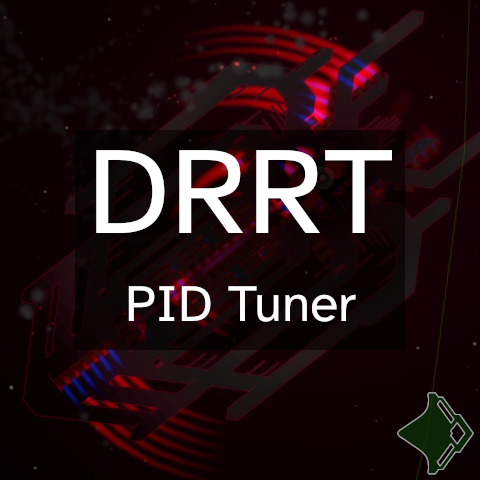

# DRRT PID Tuner



This mod is made for the Debris Regional Reassembly Tournament series.

Get this mod on [Steam](https://steamcommunity.com/sharedfiles/filedetails/?id=2975919132).

## What does this do?

EXTREMELY SIMPLE MOD that changes two cvars:
```
kNavRotKp = 5
kNavRotKd = 0.6
```
This makes all ships turn much more aggressively; i.e. ships will use the
maximum possible force from their thrusters for a longer period of time
whenever they are commanded to rotate. These P and D gains end up significantly
decreasing the steady state error and settling time for all ships when
executing a rotation.

These values are used to control how aggressively ships will want to rotate to
their target position. Changing these cvars does NOT change the behavior of the
AI; it only changes how well ships will execute the AI's commands.

Reassembly uses a PD controller; i.e., a PID controller, but without the
Integrator. `kNavRotKp` is the Proportional gain, and `kNavRotKd` is the Derivative
gain.

NOTE: This mod affects ALL ships, including your own ship in campaign mode. I
personally enjoy the snappier control, but you might not! So, beware.

## What are PID controllers, and how do they work? 

My understanding of a PID controller is as follows. I'm no controls engineer,
so don't take this as 100% correct information!

A *controller* is a device or piece of software or something similar that
directs things how to move or change. Controllers can correct errors and stuff
and are everywhere. Robot arms need a type of controller to keep them accurate
and consistent, thermostats need to hit a target temperature, et cetera.

A *feedback controller* takes information about the actual system its
controlling and calculates how far it is off from the goal. It then attempts to
correct itself using this error value. Robot arms will resist when you try to
move them, and thermostats will try to make the building warmer if the
temperature becomes too cold. This is because they use feedback controllers.

A *PID controller* is a type of simple but robust feedback controller. It doesn't
require a bunch of fancy calculations, yet is still used widely for a wide
variety of tasks.

In this context, the "system" we're controlling is your ship, and our PD
controller only pays attention to the ship's orientation. A PID controller
comprises three functions. The value passed into these functions is the
difference between the target orientation as declared by the ship's AI and the
ship's current orientation. This value is called the error of the system.

- **The Proportional controller** (the "P" in PID) takes in the current error of
  the system and outputs thrust proportional to this value. That is, when your
  ship is very far away from its target orientation, the thrusters will push
  harder than if your ship is very close to your target orientation. This is a
  simple way to correct for error, and it works. 
- **The Integral controller** (the "I" in PID) takes in the current error of the
  system and ADDS it to the sum of all previous error values passed into it.
  That is, it takes the "area under the curve" of the error; it integrates the
  error. This controller comes into play when the error of your system remains
  constant for a while; i.e. you're stuck on something and you're still trying
  to rotate. If this occurs, the Integral controller will slowly ramp up your
  ship's thrust until its sum gets back to zero. This causes your system to
  have zero or very little steady state error. 
- **The Derivative controller** (the "D" in PID) takes the current error of the
  system and finds the difference between it and the previous error value
  passed into it; it takes the difference between the current and previous
  error, the derivative of the error. Unlike the other two controllers, the
  Derivative controller by itself will not try to correct the error of the
  system, as when error is constant, it will have no influence: the derivative
  of the error is zero when error is constant. This controller is useful when
  the other controllers' influence is small: If your ship is close to the
  target orientation (i.e. low P and I influence), but the error value is
  changing rapidly, your ship will likely overshoot the rotation and oscillate
  around the target. The Derivative controller minimizes this overshooting by
  increasing power when the rate of change of error is high.

The influence of each of these functions on your system depends on the gains
assigned to them. When the gain is higher, the controller has more influence.

The "P gain" is for the Proportional controller, the "I gain" is for the
Integral controller, and the "D gain" is for the Derivative controller.

These gains are the only thing that this mod changes. Note that the I gain in
Reassembly cannot be set with a cvar and is likely 0; the I controller has no
influence on ships.

## Other Info 

I called this mod a "PID Tuner" because "PD" can be easily mistaken as an
acronym for "Point Defense".

This mod was made to look more official than a "simple cvar mod" so that
participants could more easily find it.

This mod was created to test the idea that increasing the gains of Reassembly's
PD controller would make the process of designing and watching ships that need
to aim themselves toward the enemy much less frustrating. I believe this is a
good idea for the DRRT series.

Commonly, in the DRRT series, the Standardized Factions mod is required for
ship design. This mod changes cvars that SF does not interact with. That is,
this mod's position in Reassembly's mod list relative to Standardized Factions
does not matter.

Ship in preview image is **Desonder MkIII**, by Luke AP.
